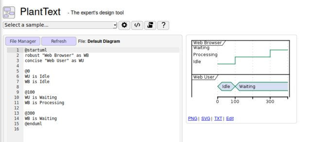

# Utilisation

## Utilisation - Ligne de commande

:::: columns
::: column

 -  Assumant le fichier: `my.puml` suivant:

    ```{.plantuml code_block=true}
    @startuml
    A -> B: My message
    @enduml
    ```

 -  Rouler:

    ```bash
    $ plantuml my.puml
    # ..
    ```

 -  Produira l'image `my.png` suivante:

     \

:::
::: column

 -  Comme le montre l'aide en ligne de commande, *png* n'est pas le seul format
    de sortie:

    ```bash
    $ plantuml -help
    # ...
    -tpng               To generate images using PNG format (default)
    -tsvg               To generate images using SVG format
    -teps               To generate images using EPS format
    -tpdf               To generate images using PDF format
    -tvdx               To generate images using VDX format
    -txmi               To generate XMI file for class diagram
    -tscxml             To generate SCXML file for state diagram
    -thtml              To generate HTML file for class diagram
    -ttxt               To generate images with ASCII art
    -tutxt              To generate images with ASCII art using Unicode characters
    -tlatex             To generate images using LaTeX/Tikz format
    -tlatex:nopreamble  To generate images using LaTeX/Tikz format without preamble
    # ..
    ```
:::
::::


## Utilisation - Ligne de commande (suite)

:::: columns
::: column

 -  Ma recommandation en générale est de générer une image [svg]:

    ```bash
    $ plantuml -tsvg my.puml
    # ..
    $ ls
    my.puml my.svg # ..
    ```

    Voici pouquoi:

     -  Format vectoriel sans perte / non discrétisé. Vous ne serez pas limité
        à un affichage à un dpi spécifique.

     -  Textuel, donc mieux supporté par `git` et autres système de gestions de
        code source.

     -  S'ouvre à l'aide de n'importe que navigateur moderne (e.g: 
        `firefox ./my.svg`).

:::
::: column

 -  Voici le résultat:

    {width=75%} \

 -  Bien remarquer également la *transparent* du fond de l'image contrairement au *png*.

:::
::::


[svg]: https://www.w3schools.com/graphics/svg_intro.asp

## Utilisation - Makefile

 -  On peut en quelques lignes se faire un petit makefile (gnu dans ce cas-ci)
    permettant de produire des images (`*.svg` dans ce cas) pour l'ensemble
    des fichier de code `*.puml` dans une arborescence de répertoires:

    :::: columns
    ::: column

    ```{.Makefile .stretch}
    MKF_CWD := $(shell pwd)
    OUTPUT_REL_DIR := .
    SRC_PUML := $(shell \
    	find . -mindepth 1 -type f -name '*.puml' -printf '%P\n')
    OUT_SVG_FROM_PUML := $(patsubst \
    	%.puml,$(OUTPUT_REL_DIR)/%.svg,$(SRC_PUML))


    .PHONY: all clean svg-from-puml clean-svg-from-puml
    all: svg-from-puml
    clean: clean-svg-from-puml
    svg-from-puml: $(OUT_SVG_FROM_PUML)
    clean-svg-from-puml:
    	rm -f $(OUT_SVG_FROM_PUML)

    .SECONDEXPANSION:
    $(OUTPUT_REL_DIR)/%.svg : %.puml | $$(@D)/.
    	plantuml -tsvg -o "$(MKF_CWD)/$(@D)/" "$<"
    ```

    :::
    ::: column

    ```bash
    $ make
    plantuml -tsvg -o "/my/cwd/./" "AtRoot.puml"
    plantuml -tsvg -o "/my/cwd/SubDir/" "SubDir/InSubDir.puml"
    $ tree
    .
    ├── AtRoot.puml
    ├── AtRoot.svg
    ├── Makefile
    └── SubDir
        ├── InSubDir.puml
        └── InSubDir.svg

    1 directory, 5 files
    ```

     -  Un avantage vis-à-vis `plantuml -r` (mode récursif de PlantUML) c'est qu'on a
        un bien meilleur contrôle sur les images en sortie (où on les envoi, etc).

    :::
    ::::

     -  Également, le makefile ne relancera pas la commande si le fichier de source est inchangé.


## Utilisation - Extension vscode

:::: columns
::: column
{width="100%"} \
:::
::: column

 -  [Vscode - PlantUML extension]

    Une extension permettant d'obtenir un *preview pane* du code plantuml.

    Amène également un support de *syntax highlighting* pour le code source
    plantuml.

     -  Ouvrir le fichier `*.puml`, `*.iuml` ou `*.wsd`.
     -  Mettre votre pointeur à l'intérieur de la zone `@start` / `@end`.
     -  `Alt + D`.
     -  Un panneau s'ouvrira à droite avec la version *rendue* de votre diagramme.

 -  Une excellent façon d'itérer sur un diagramme.

 -  À noter: le panneau se rafraîchit automatiquement lorsque vous éditez le code.

:::

::::

[Vscode - PlantUML extension]: https://marketplace.visualstudio.com/items?itemName=jebbs.plantuml


## Utilisation - Cloud

Pour tous nos amis qui ont la tête dans les nuages, plusieurs solutions
s'offrent à vous:

:::: columns
::: column

{width=100%} \

:::
::: column

 -  [PlantText UML Editor]

    Un simple editeur en ligne, split view code / output.

:::
::::

 -  [PlantUML for Confluence Cloud - Atlassian Marketplace]

    Le plugin est même gratuit, ce qui est plutôt rare chez Atlassian!

 -  [PlantUML in draw.io](https://about.draw.io/use-plantuml-in-draw-io/)

    Il semblerait que ce système de diagram libre supporte également PlantUML.


[PlantText UML Editor]: https://www.planttext.com/
[PlantUML for Confluence Cloud - Atlassian Marketplace]: https://marketplace.atlassian.com/apps/1215115/plantuml-for-confluence-cloud?hosting=cloud&tab=installation
[Use PlantUML in draw.io]: https://about.draw.io/use-plantuml-in-draw-io/


## Utilisation - Microsoft Word / Open office

:::: columns

::: column
<iframe width="100%" height="500"
 src="https://www.youtube.com/embed/eofooJgjdE0?autoplay=1"
 allow="autoplay; encrypted-media">
  [Demonstration PlantUML Word](https://www.youtube.com/watch?v=eofooJgjdE0)
</iframe>
:::

::: column

 -  On voit ici à gauche la démonstration d'une macro pour l'intégration PlanUML
    dans Microsoft Word.

    Rappelez vous, c'était l'une des motivation principales de l'auteur.

    [PlantUML - Word Add-in]

 -  Je ne suis pas certain que tout fonctionne encore bien avec Office 365
    (puisqu'en ligne), du moins sans avoir à payer une souscription! À essayer
    avec la version installé.

:::
::::

 -  Il existe également une intégration Libre/Open office:

    [Libo_PlantUML - PlantUML in LibreOffice]

[PlantUML - Word Add-in]: https://plantuml.com/word
[Libo_PlantUML - PlantUML in LibreOffice]: https://extensions.libreoffice.org/extensions/libo_plantuml


## Utilisation - À même un doc markdown

:::: columns
::: column

![[Markdown Preview Enhanced - Support PlantUML]](./img/vscode-markdown-enhanced-plantuml.png){width="100%"}

:::
::: column

 -  Une extension **vscode et atom** supportant le rendu de blocs de code *PlantUML*
    se trouvant directement **dans** un fichier [markdown] (`*.md`).

     -  Support l'import de fichier `*.puml` externe via la directive `@import`.
     -  Support plusieurs autres types de diagrammes / visualisations.
     -  L'intérêt ici c'est de se servir des diagramme pour expliquer quelque chose:
        le diagramme **vient en support au texte**.

:::
::::

 -  Il est également assez simple d'automatiser *workflow* en combinant
    [pandoc], PlantUML et un *build system* au choix (e.g.: [gnumake]).

    Voir [pandoc-md-wiki] pour un example d'intégration. Cette présentation en
    est d'ailleur un example.


[Markdown Preview Enhanced - Support PlantUML]: https://shd101wyy.github.io/markdown-preview-enhanced/#/diagrams?id=plantuml
[pandoc-md-wiki]: https://github.com/jraygauthier/pandoc-md-wiki
[pandoc]: https://pandoc.org/
[gnumake]: https://www.gnu.org/software/make/
[markdown]: https://daringfireball.net/projects/markdown/

## Utilisation - Autres

 -  On trouve des intégration PlantUML avec pratiquement tout les outils de
    développement ayant un minimum de sérieux.

    Un peu au même titre que [Graphviz - Dot]

 -  [PlantUML - Intégration Doxygen]

    Possible d'intégrer à Doxygen avec quelques efforts.

 -  [PlantUML - Intégration Sphinx]

    Même chose pour Sphinx. Il s'agit d'un package contribué.

 -  [Tools using the PlantUML language](https://plantuml.com/running)

    Pour tout le reste.

[Doxygen]: http://www.doxygen.nl/
[Sphinx]: http://www.sphinx-doc.org/en/master/
[Graphviz - Dot]: https://www.graphviz.org/
[PlantUML - Intégration Doxygen]: https://plantuml.com/doxygen
[PlantUML - Intégration Sphinx]: https://build-me-the-docs-please.readthedocs.io/en/latest/Using_Sphinx/UsingGraphicsAndDiagramsInSphinx.html#using-plantuml

